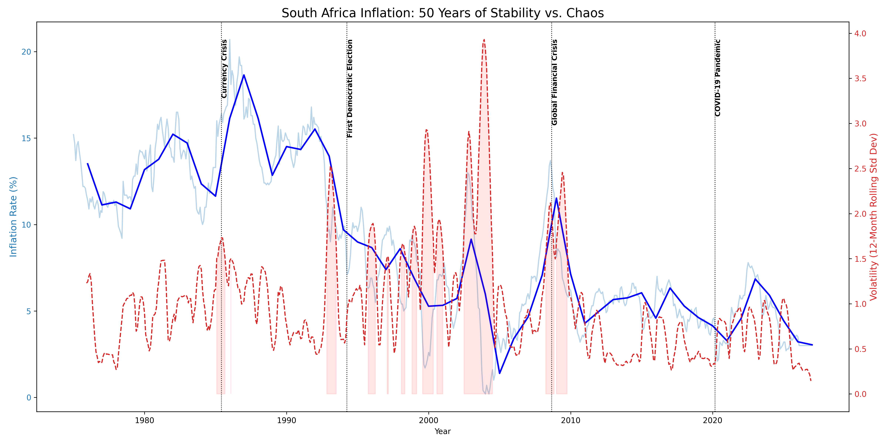

# 📉 SA Inflation: Eras of Chaos vs. Stability

A historical analysis project visualizing 50 years of South African inflation data to identify periods of economic volatility and structural breaks.

## 📊 Project Overview

While forecasting predicts the future, this project analyzes the past. By calculating rolling volatility (standard deviation), we segment South Africa's economic history into "Eras of Stability" and "Eras of Chaos," correlating these periods with major historical events.

## 📈 Dataset

-   **Source:** Kaggle [(South Africa Inflation Rate 1975-2026)](https://www.kaggle.com/datasets/katlegokgaswa/south-africa-inflation-rate).
-   **Features:** Monthly inflation rates (%).
-   **Timeframe:** January 1975 – February 2026.

## 🛠️ Methodology

1.  **Data Transformation:** Converted wide-format yearly data into a continuous monthly time series.
2.  **Volatility Calculation:** Computed a 12-month rolling standard deviation to measure how "jumpy" inflation was.
    -   **Low Volatility:** Predictable prices.
    -   **High Volatility:** Erratic prices, indicating economic panic.
3.  **Structural Breaks:** Identified specific months where volatility exceeded a threshold (Std Dev > 1.5).
4.  **Event Annotation:** Mapped major events (1994 Election, 2008 Crisis, COVID-19) to the data to validate economic reactions.

## 🚀 Key Findings

-   **High Volatility Eras:** The analysis identified 95 months of extreme volatility, primarily clustered around the mid-1980s currency crisis and the 2008 global financial crash.
-   **Post-1994 Stabilization:** Visual analysis suggests a trend towards lower volatility (more stable prices) in the decades following the democratic transition, until recent global shocks.

## 📁 Files Included

-   `inflation_history.py`: Python script for data cleaning, volatility calculation, and historical visualization.
-   `inflation_volatility_history.png`: Dual-axis chart comparing inflation rate (blue) against economic volatility (red), annotated with key historical events.

## 🏃 Running the Project

### Prerequisites

-   Python 3.8+
-   Virtual Environment (venv)

### Installation

1.  Clone the repository and navigate to the directory.
2.  Create and activate a virtual environment:
    
    ```bash
    python -m venv venv
    ```
    ```bash
    venv\Scripts\activate
    ```
    

1.  Install required libraries:
    
    ```bash
    
    pip install pandas matplotlib
    ```

### Usage

Run the analysis script:

```bash

python inflation\_history.py
```
The script will output the number of high-volatility months detected and generate a detailed historical chart.


